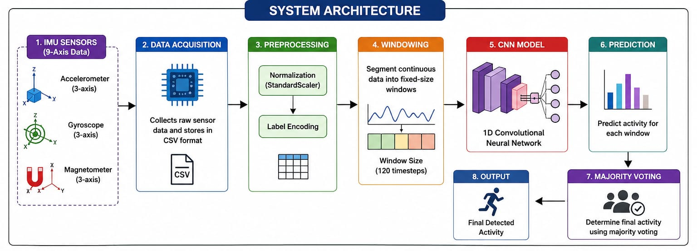
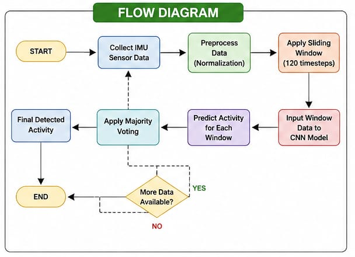
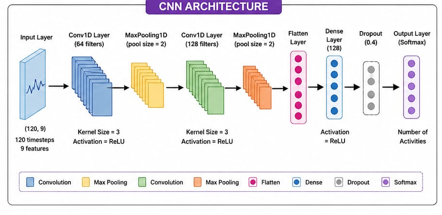
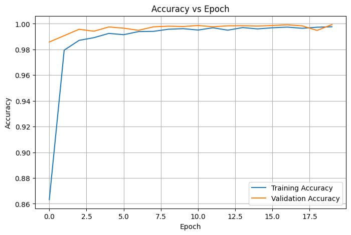
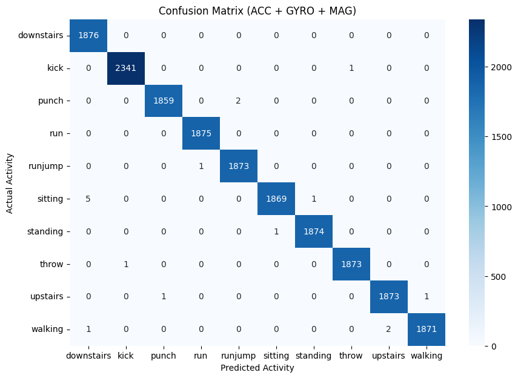

#  Human Activity Recognition using IMU + CNN

 A high-accuracy **Human Activity Recognition (HAR)** system using **Accelerometer, Gyroscope, Magnetometer (IMU)** and **1D Convolutional Neural Network (CNN)**.

---

##  Overview

This project implements a **deep learning-based activity recognition system** using multi-sensor IMU data.

It detects activities such as:

* 🚶 Walking
* 🏃 Running
* 🪑 Sitting
* 🧍 Standing
* 🪜 Upstairs / Downstairs

The system combines **sensor fusion + time-series analysis + CNN** to achieve high accuracy.

Final Output: **Detected Human Activity**

---

##  Working Principle

1. **IMU Sensors** capture motion data (ACC + GYRO + MAG)
2. Data is preprocessed:
   - Normalization (StandardScaler)
   - Label encoding
3. Data is segmented using:
   - Sliding window (120 timesteps)
4. **1D CNN Model** learns temporal patterns
5. Predictions generated per window
6. **Majority Voting** → Final activity output

---

##  System Architecture

---

##  Flow Diagram

---

##  CNN Architecture

---

##  Results

###  Accuracy Graph

###  Confusion Matrix

---

## ✨ Key Features

* ✅ 9-axis IMU sensor fusion (ACC + GYRO + MAG)
* ✅ Time-series segmentation (120 timesteps)
* ✅ Deep learning using 1D CNN
* ✅ Automatic feature extraction
* ✅ Majority voting for stable predictions
* ✅ High accuracy (~99.7%)
* ✅ Scalable and deployable system

---

##  Performance

* 🎯 Training Accuracy: ~99.8%
* 🎯 Validation Accuracy: ~99.7%
* 🎯 Test Accuracy: ~99.7%
* ⚡ Fast convergence and stable predictions

---

##  Input Features

* X, Y, Z Acceleration
* X, Y, Z Angular Velocity
* X, Y, Z Magnetic Field

---

##  Software & Tools

* Python (NumPy, Pandas)
* TensorFlow / Keras
* Scikit-learn
* Matplotlib & Seaborn
* Google Colab / Jupyter Notebook

---

---

## 📥 Dataset

👉 https://www.kaggle.com/datasets/sakshishukralia/smartaberration 

Place dataset inside:

---

## ▶️ How to Run

### Step 1: Downlode the dataset
(use link given above)

---

### Step 2: Paste the code in COLAB
* Paste the code in COLAB
* copy the path of dataset
---

### Step 3: Train Model
✔ This will:
* Train CNN model  
* Generate accuracy graph  
* Show confusion matrix  
* Save model files  

---

### Step 4: Run Prediction

Place test CSV file in:
Run:

---

### Step 5: Output

* Sample predictions  
* Final detected activity  
* Activity distribution  

---

## 🔮 Future Scope

* 🤖 Real-time HAR using wearable devices
* 📱 Mobile app integration
* ☁️ Cloud-based monitoring
* 🧠 LSTM / Transformer models
* 🎥 Multimodal AI (sensor + video + audio)

---

## 📜 License

This project is licensed under the **MIT License**.

---

## 🙌 Acknowledgment

Developed as part of **Machine Learning / Deep Learning Project**  
KLE Technological University

---

## ⭐ Support

If you like this project, give it a ⭐ on GitHub!
